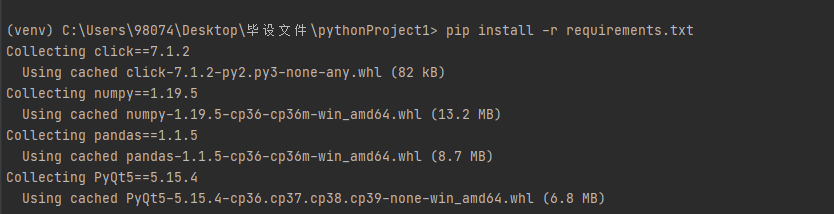

# 2021_Graduation_project


**安装 python 3.6.8**

https://www.python.org/downloads/


版本选择


操作系统选择


或者直接复制下面的内容到浏览器

windows：https://www.python.org/ftp/python/3.6.8/python-3.6.8-amd64.exe


**创建虚拟环境**

利用pycharm创建虚拟环境  file - newproject  选择这个文件夹，编译器用系统安装的3.6.8


创建成功之后将main.py删除，只剩venv环境包。


1 利用git将包从github上拉取下来。

仓库地址 https://github.com/TrackNNN/2021_Graduation_project


 打开终端


通过github获取文件


将文件放到虚拟环境下


指令

```shell
git clone git@github.com:TrackNNN/2021_Graduation_project.git
```


2 解压。

直接将file.rar的文件都解压后放到当前虚拟环境目录。


**安装依赖包**

包的名字在requirements里面，有关这个可以看

http://www.manongjc.com/detail/19-jubsipodirpvdvv.html

```shell
pip install -r requirements.txt
```




**运行**

运行脚本获取日志之后再运行本程序，脚本的说明文件在 ./script/readme.md（当前目录下的script文件夹）


共享文件

需要共享的文件的指令是

sudo mount -t  vboxsf shareFloder  /home/osdesign/shareFloder  

sudo mount -t vboxsf debugInfo /home/osdesign/newdisk/umake/debuginfo

sudo mount -t vboxsf tool /home/osdesign/newdisk/umake/tools

对应的栈数据存放的地址要填写到工程的 IO_processing_module.py 的 gdb_log_path


**操作过程**


到对应的目录下


启动脚本


清空初始化的数据


选择qemu，输入对应的指令


这时候存放日志的文件加载新的数据：


启动可视化

