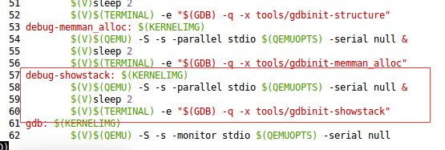

gdbinit-showstack是放到haribote的 umake/tools 文件夹的脚本，这边放了几个脚本，需要运行的时候修改文件名放到tools文件夹即可。

1 进程创建

2 进程中断

3 进程销毁

4 进程创建->进程切换->执行DIR指令->进程销毁->进程切换内核态。


1 安装VMBOX

2 在VMBOX上运行haribote系统

3 共享文件

* 如果是在linux系统下运行可视化程序，那么路径就是~/newdisk/umake/debug
* 如果是windows，需要挂载一下。

4 操作

* 修改makefile文件，默认是没有stack脚本的。



```shell
debug-showstack: $(KERNELIMG)
		$(V)$(QEMU) -S -s -parallel stdio $(QEMUOPTS) -serial null &
		$(V)sleep 2
		$(V)$(TERMINAL) -e "$(GDB) -q -x tools/gdbinit-showstack"
```

* 创建  tools debuginfo tmp 文件夹（$haribotePath/umake目录下）

```
mkdir tools debuginfo tmp
```

* 将对应的脚本文件名字改成gdbinit-showstack，放到 $haribotePath/umake/tools（$haribotePath是操作系统路径）

* 首先在umake目录下   ./startdebug_showstack，启动GDB调试操作系统。
* 然后将初始化的日志删除掉，然后按照下面的操作来生成日志
* 产生日志之后，在可视化程序的terminal > python main.py，启动程序读取处理可视化日志。
第一次加载可能有点慢，因为要加载包。


1 进程创建

脚本文件gdbinit-showstack-1，按照4操作进行。

命令行输入start exit，生成一个新的控制台，会产生进程创建过程日志，然后exit退出进程。


2 进程销毁

脚本文件gdbinit-showstack-2，按照4操作进行。

在命令行输入 exit，产生进程销毁的日志。


3 进程创建->进程切换->执行DIR指令->进程销毁->进程切换内核态。

脚本文件gdbinit-showstack-3

1 在第一个命令行输入  start dir

2 tab切换到命令行。

3 输入exit

4 最后在原来的命令行输入exit

